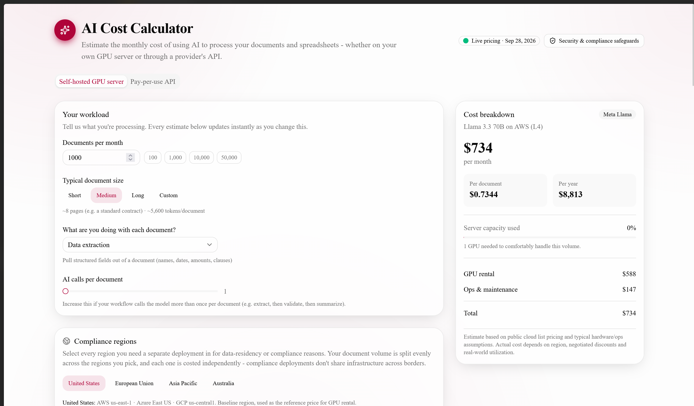
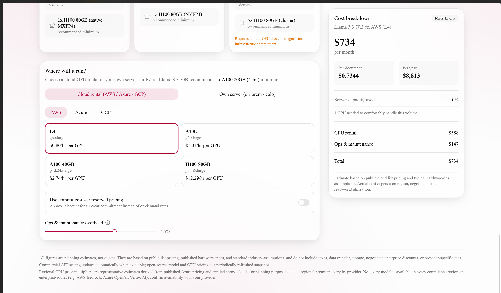

# AI Cost Lens

A cost-estimation calculator for enterprise AI adoption. It answers the question finance and
procurement teams ask before signing off on an AI initiative: "if we process this volume of
documents with this model, what will it actually cost per month?"

**Live app:** [ai-cost-calc-tgl.vercel.app](https://ai-cost-calc-tgl.vercel.app/)

## Screenshots

Self-hosted GPU server estimator - workload, compliance regions, and the live cost breakdown:

Hosting and GPU selection, with per-GPU pricing and ops overhead:

## Problem it solves

Estimating AI spend is harder than it looks. Pricing is quoted per token, not per document;
commercial model prices, GPU rental rates, and hardware costs all change independently; and the
same workload can be served through a pay-per-use API, a self-hosted open-source model, or a
routed combination of several models at very different price points. Teams evaluating AI vendors
typically end up guessing, or building a one-off spreadsheet that goes stale within weeks.

AI Cost Lens turns those inputs into a single, defensible monthly estimate, with a full breakdown
of where the money goes, so a non-technical stakeholder can compare options without needing to
understand tokens, GPUs, or model pricing tiers.

## Features

- **Self-hosted GPU estimator** - a catalog of open-weight models (Llama, Mistral, Qwen, DeepSeek,
  Gemma, Phi, GPT-OSS, Nemotron) sized against cloud GPU rental (AWS, Azure, GCP) or owned
  hardware, including electricity and ops overhead.
- **Pay-per-use API estimator** - a catalog of mainstream commercial models (Anthropic, OpenAI,
  Google, Amazon, Mistral, xAI, Cohere) with live pricing, an intelligence/speed/price rating per
  model, and an instant cost breakdown for a given document volume and task.
- **Smart model routing** - models a tiered routing setup (Low / Medium / High) where a lightweight
  decision model classifies each request and only escalates the ones that need a more capable
  model, with a structural guardrail that prevents a misconfigured setup from costing more than
  using the top-tier model outright.
- **Multi-region compliance deployments** - splits volume across selected regions (US, EU,
  Asia-Pacific, Australia) with region-specific GPU pricing and an optional data-residency premium,
  since compliance-driven deployments cannot share infrastructure across borders.
- **Security and compliance safeguards reference** - a built-in summary of the controls (traffic
  filtering, model integrity/supply-chain verification, observability, data residency) a
  self-hosted deployment is expected to answer for in a procurement or security review.
- **Always-visible breakdowns** - every estimate shows its line items (input/output tokens, router
  decisions, compute, electricity, overhead) rather than a single opaque number.

## How it works

The app is a static, client-rendered calculator: all pricing math runs in the browser against a
curated data set of model and hardware pricing. Commercial model pricing is refreshed from
OpenRouter's public pricing API on each load where available, and falls back to a manually
verified snapshot otherwise (with the snapshot date shown in the UI). Open-source model
specifications, GPU rental rates, and regional multipliers are periodically refreshed reference
data, since no live API exists for them.

Given a workload (document volume, size, task type) and a model or hosting configuration, the
calculator estimates token volume, applies the relevant pricing, and produces a monthly cost, a
cost per document, and an itemized breakdown - recomputed live as any input changes.

## Tech stack

Next.js (App Router), TypeScript, Tailwind CSS, and Radix-based UI components. No backend or
database - the only server-side piece is a lightweight API route that proxies and caches live
pricing. Vitest and React Testing Library cover the calculation engine and core UI flows.

## Disclaimer

All figures are planning estimates based on public list pricing and standard industry assumptions.
They are not quotes and do not include taxes, negotiated enterprise discounts, or
provider-specific fees.
